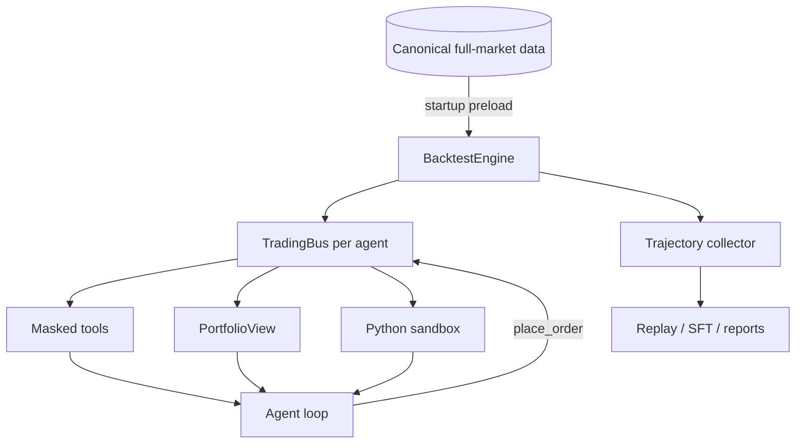

# Core architecture

## Non-negotiable invariants

### Zero I/O during a run

The engine preloads the full required market slice before the first trading day. Agent tool calls perform in-memory lookups and never fetch provider data or read the canonical dataset.

### Strict historical visibility

Daily bars use `date < current_date`. Fundamentals use `pub_date <= current_date`. Five-minute bars are truncated to the active phase and sub-window. Agent-facing absolute dates become relative offsets.

### Single order path

`TradingBus.place_order()` applies lot size, suspension, cash, position, price-limit, fee, and visible-price checks. There is no second fast path for agents, committees, or the sandbox.

### Environment-owned accounting

The environment owns the portfolio. Agents receive a read-only view and can only mutate state through validated orders. Dividends, stock distributions, and end-of-day equity are deterministic engine operations.

## Replay contract

Each recorded LLM request has a canonical SHA-256 fingerprint. Replay rejects changed requests and exhausted cassettes. It never falls back to a network model, which makes regression failures explicit rather than silently non-deterministic.
