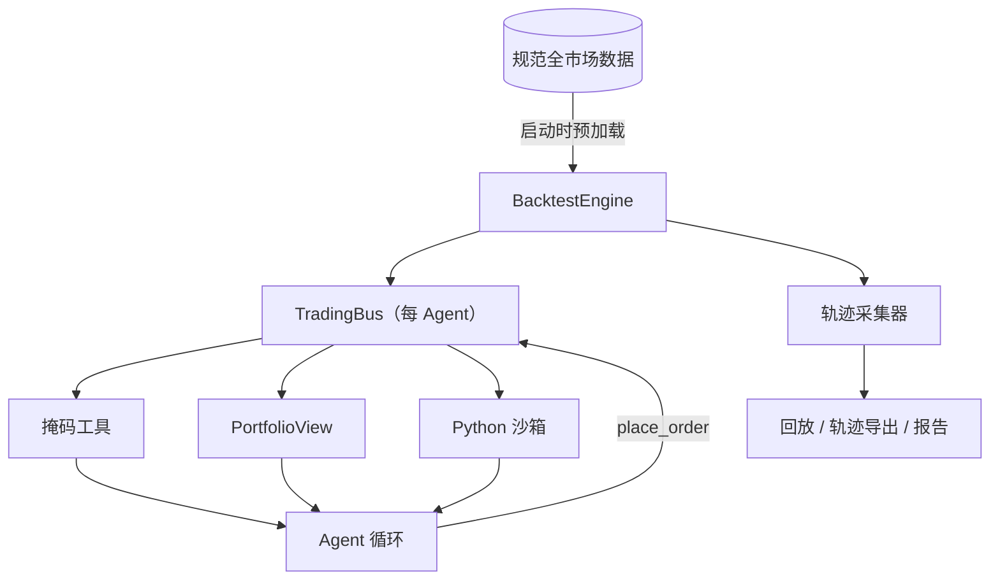

# 核心架构

## 不可妥协的不变量

### 运行期零 I/O

引擎在第一个交易日之前预加载所需的全部行情切片。Agent 的工具调用只做内存查询，绝不回源拉取供应商数据，也不直接读取规范数据集。

### 严格的历史可见性

日线使用 `date < current_date`；基本面使用 `pub_date <= current_date`；5 分钟线截断到当前阶段与子窗口；面向 Agent 的绝对日期一律变为相对偏移。

### 唯一下单路径

`TradingBus.place_order()` 统一施加整手、停牌、现金、持仓、涨跌停、费用与可见价格校验。不存在供 Agent、委员会或沙箱绕行的第二条快速通道。

### 环境托管账户

账户由环境所有。Agent 只获得只读视图，只能通过校验过的订单改变状态。分红、送转与每日净值是确定性的引擎操作。

## 回放契约

每条记录的 LLM 请求都有规范的 SHA-256 指纹。回放会拒绝被改动的请求与耗尽的盒带，也绝不回退到联网模型——这让回归失败显式暴露，而不是悄无声息地变得不确定。
