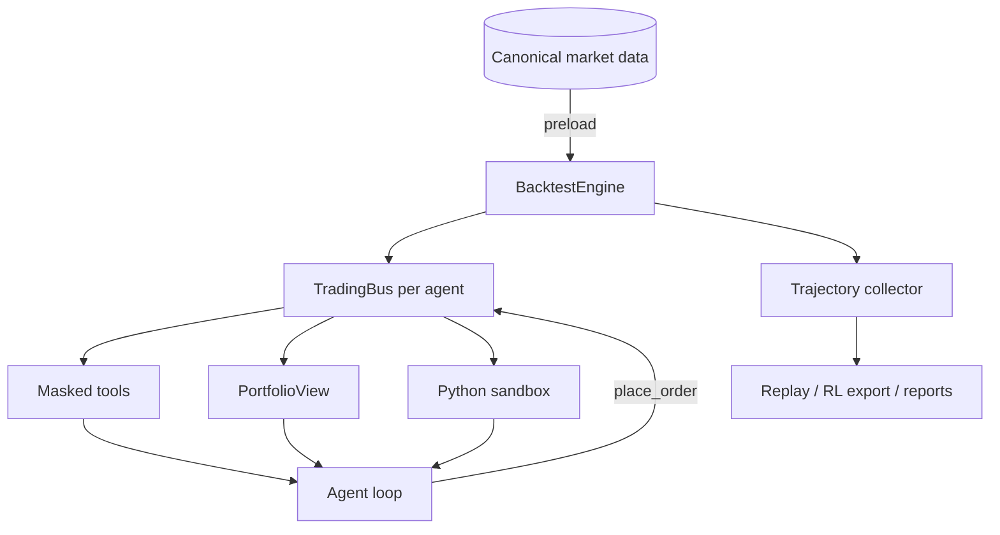

# Architecture

## Non-negotiable invariants

### No backtest-time I/O

The engine preloads every required market slice before the first trading day. Agent tools query memory only and cannot fetch provider data or read the canonical dataset directly.

### Strict historical visibility

Daily bars use `date < current_date`; fundamentals use `pub_date <= current_date`; intraday bars stop at the current phase and sub-window; agent-facing absolute dates become relative offsets.

### One order path

`TradingBus.place_order()` enforces board lots, suspension, cash, holdings, price limits, fees, and visible-price checks. Agents, committees, and sandbox code have no second path.

### Environment-owned portfolios

Agents receive read-only views. Only validated orders change state; dividends, corporate actions, and daily equity are deterministic engine operations.

## Replay contract

Each recorded LLM request has a canonical SHA-256 fingerprint. Replay rejects modified requests and exhausted cassettes and never falls back to a network model. Regression failures remain explicit instead of becoming silently nondeterministic.
