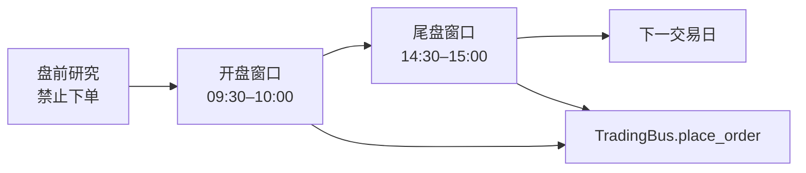

# TraderHarness

**抗数据污染的 LLM 交易 Agent 回测环境——也是建立在每一次运行之上的轨迹训练数据合成器。**

它为 LLM 提供一个历史有效的 A 股市场、一套受控的研究工具，以及由环境托管的账户。Agent 可以调查研究、执行 Python 分析、修正论点，并通过唯一可审计的下单路径完成交易。

[安装并运行 →](quickstart.md){ .md-button .md-button--primary }
[在 GitHub 查看](https://github.com/HephaestLab/TraderHarness){ .md-button }

*本地研究控制台实拍：回测逐日展开，像素办公室里的 Agent 实时研究、下单、复盘。*

## 为什么它是"评测框架"而不只是"回测器"

通用大模型可能认得自己被测试的那段历史——日期、公司、行情都可能在训练语料里出现过，这种泄漏会悄悄让评测结论失效。TraderHarness 把抗污染做成环境边界，而不是提示词约定：

- 日线、分钟线、基本面、公告、新闻全部经过严格时点掩码
- 公司实体与日历日期的确定性匿名化（`D+0`、`公司-600731`）
- 5 分钟级渐进可见，分钟级撮合，决策时不可见的价格不可成交
- 引擎预加载后零行情 I/O，同一输入必然复现同一结果
- 全保真轨迹记录与失败即报错（fail-closed）的指纹回放
- 独立多 Agent 对比，以及单执行者多角色委员会
- 沪深 300 基准、风险指标与行为诊断

## 三阶段交易循环，唯一下单路径

每一个面向 Agent 的数据出口都经过掩码；每一笔订单都由同一条 `TradingBus.place_order()` 路径校验与撮合。现金、持仓、公司行动与净值核算由环境——而不是模型——掌握。

## 研究控制台实拍

| 实时运行 | 逐笔复盘 |
|---|---|
|  |  |
| 像素办公室 + 决策事件流 + 实时净值 | K 线上下文 + 下单理由 + 执行证据 |

| 回测研究档案 | 跨回测对比 |
|---|---|
|  |  |
| 绩效、行为、基准与逐笔证据归一档 | 多次回测权益曲线叠加与关键指标横评 |

!!! warning "研究基础设施"
    历史模拟不保证实盘表现，也不建模市场冲击。TraderHarness 不是投资建议，也不是券商服务。
