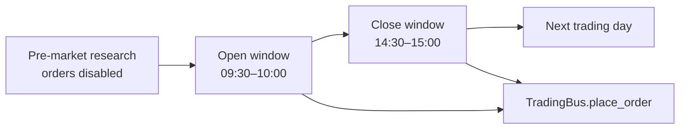

# TraderHarness

**TraderHarness is a contamination-resistant market environment for autonomous trading agents.**

It gives an LLM a historically valid A-share market, a controlled research toolkit, and an environment-owned portfolio. The agent may investigate, execute Python analysis, revise its thesis, and trade through one auditable order path.

[Install and run :material-arrow-right:](quickstart.md){ .md-button .md-button--primary }
[View on GitHub](https://github.com/HephaestLab/TraderHarness){ .md-button }

## What makes it an evaluation harness

- Strict point-in-time masks on bars, fundamentals, announcements, and news
- Deterministic company and calendar anonymization
- Progressive 5-minute visibility with minute-level order matching
- Zero market-data I/O after the engine preload
- Full-fidelity trajectories and fail-closed replay cassettes
- Independent multi-agent comparison and single-executor committees
- CSI 300 benchmark, risk metrics, and behavioral diagnostics

## Three phases, one order path

Every agent-facing data outlet is masked. Every order is validated and matched by the same `TradingBus.place_order()` path. The environment—not the model—owns cash, positions, corporate actions, and equity accounting.

!!! warning "Research infrastructure"
    Historical simulation does not guarantee live performance and does not model market impact. TraderHarness is not investment advice or a brokerage service.
